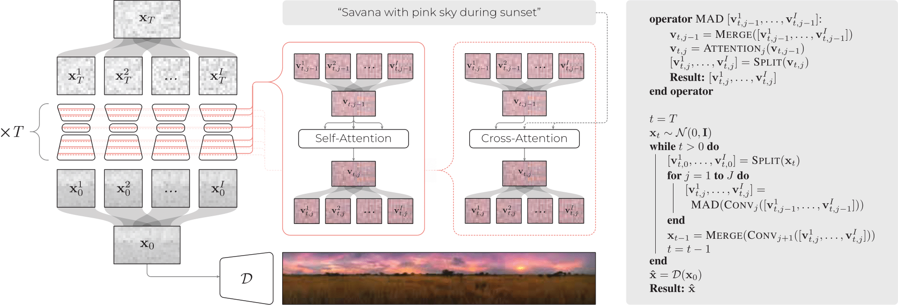

# MAD: Merging and Splitting Diffusion Paths for Semantically Coherent Panoramas

[](https://link.springer.com/chapter/10.1007/978-3-031-72986-7_14)
[](https://arxiv.org/pdf/2408.15660.pdf)
[](./imgs/MAD_poster.pdf)


## Introduction
Official PyTorch implementation for "Merging and Splitting Diffusion Paths for Semantically Coherent Panoramas", presenting the Merge-Attend-Diffuse operator.

<p align="center">
  
</p>
<p align="center">
  Overview of the proposed inference-time pipeline (left) and its pseudo-code (right)
</p>

The code is tested on Python 3.11.7, CUDA 12.1, and PyTorch 2.1.2

If you find it useful, please cite it as:
```
@inproceedings{quattrini2024merging,
  title={{Merging and Splitting Diffusion Paths for Semantically Coherent Panoramas}},
  author={Quattrini, Fabio and Pippi, Vittorio and Cascianelli, Silvia and Cucchiara, Rita},
  booktitle={Proceedings of the European Conference on Computer Vision},
  year={2024},
  organization={Springer}
}
```

## Installation
This is the list of python packages that we need to run inference 
```console
conda create --name mad python=3.11.7
pip install -r requirements.txt
```


## Inference with Stable Diffusion
Basic code to run inference with the default parameters
```
python sample_panorama_stable_diffusion.py
```

Some suggestions:
```
python sample_panorama_stable_diffusion.py --prompt "A shelf full of colorful books"

python sample_panorama_stable_diffusion.py --prompt "Tube map of London"

python sample_panorama_stable_diffusion.py --prompt "A whole shepherd pie"
```


## Inference with Stable Diffusion XL
Basic code to run inference with the default parameters
```
python sample_panorama_stable_diffusion_xl.py
```

## Inference with LCM
Basic code to run inference with the default parameters
```
python sample_panorama_lcm.py
```

Some suggestions:
```
python sample_panorama_lcm.py --prompt "A pride concert full of colorful fireworks"

python sample_panorama_lcm.py --prompt "Top-view of a square pizza"
```

Some suggestions of vertical images:
```
python sample_panorama_lcm.py --prompt "A tower in a colorful sky" --W 512 --H 2048

python sample_panorama_lcm.py --prompt "A view of a river inside a canyon" --W 512 --H 2048
```

## Acknowledgements
Our code is heavily based on the [implementation](https://github.com/omerbt/MultiDiffusion) of [MultiDiffusion](https://multidiffusion.github.io/)
